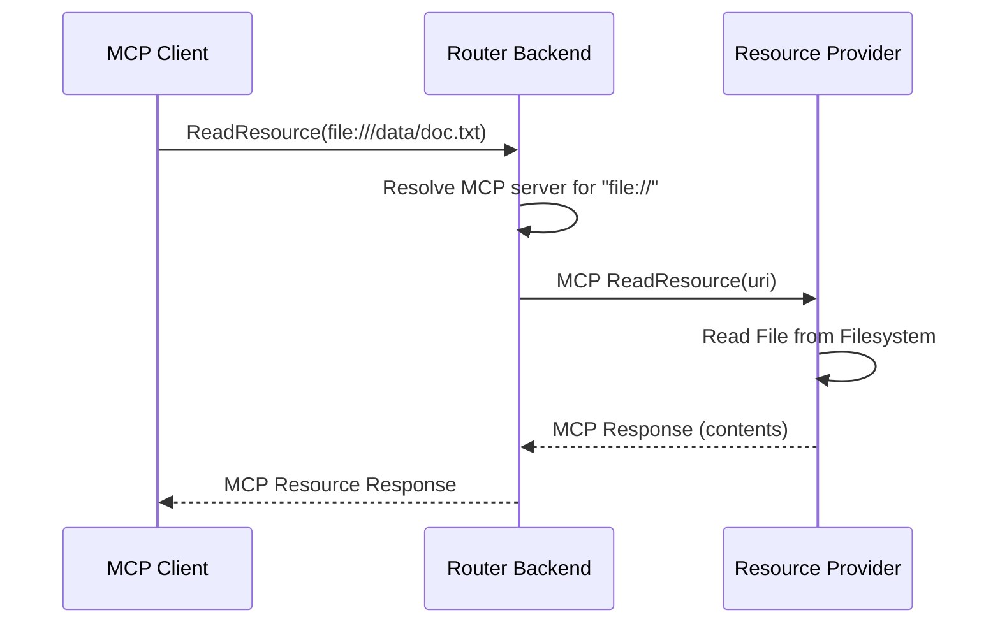
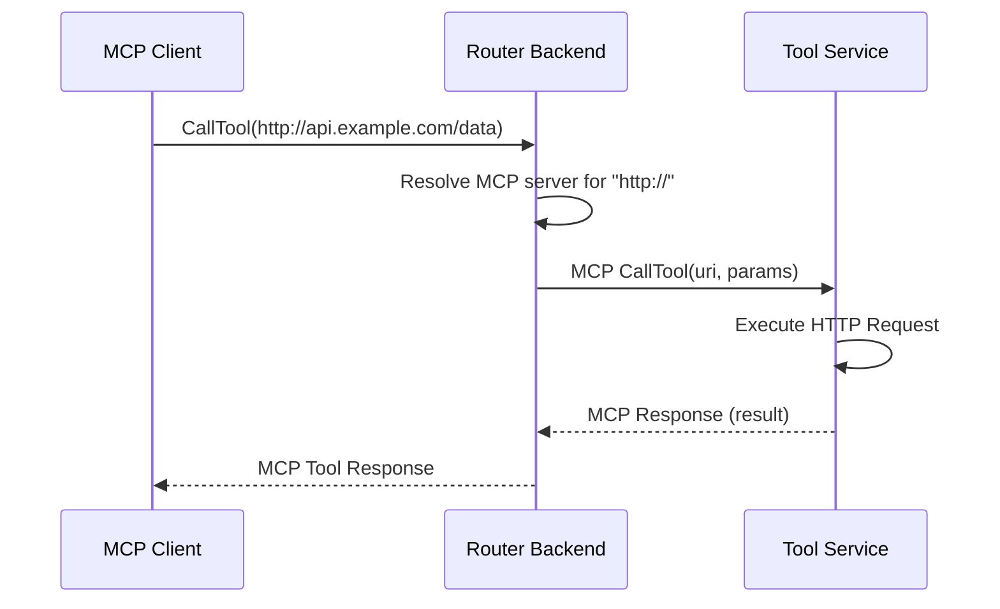

# Wanaku MCP Router Internals

This document provides a detailed look at the internal architecture and implementation of the Wanaku backend.

> [!NOTE]
> The primary MCP routing engine is now [Wanaku Praxis](https://github.com/wanaku-ai/wanaku), a Rust-based router.
> The wanaku-barn backend described here handles persistence, service catalogs, MCP server registration, and administration.
> In hybrid deployments, Praxis routes MCP requests while proxying management operations to this backend.

## Overview

The Wanaku backend provides persistence, service catalog management, MCP server registration, and administration APIs. It handles authentication, service discovery, namespace management, and request routing for downstream MCP servers.

## Resources

A resource is, essentially, anything that can be read by using the MCP protocol. For instance:

- Files
- Read-only JMS Queues
- Topics
- Static resources (i.e.: a web page)

Among other things, resources can be subscribed to, so that changes to its data and state are notified
to the subscribers.

Ideally, providers should leverage [Apache Camel](https://camel.apache.org/) whenever possible.

## Tools

A tool is anything that can be invoked by an LLM in a request/response fashion and used to provide data to it.

Examples:

- Request/reply over JMS
- Calling REST APIs
- Executing subprocesses that provide an output
- Executing an RPC invocation and waiting for its response

## Service Resolution

The router maintains a service registry that tracks which downstream MCP servers are available to handle specific tool or resource types.

## Component Interaction Patterns

### Resource Read Pattern

When an LLM requests a resource, the following interaction occurs:

### Tool Invocation Pattern

When an LLM invokes a tool, the interaction pattern is:

## Key Design Patterns

### Factory Pattern

Service creation uses factories to:

- Instantiate appropriate implementations based on URI schemes
- Handle service registration and deregistration

### Strategy Pattern

Different MCP server types use strategy pattern to:

- Implement specific tool invocation logic
- Handle different resource types and protocols
- Apply different authentication mechanisms

## Thread Safety and Concurrency

### Concurrent Request Handling

- **Async Processing**: Router uses Quarkus reactive programming model
- **State Management**: Service registry uses concurrent data structures

### Isolation Guarantees

- **Request Isolation**: Each MCP request is processed independently
- **Service Isolation**: MCP servers run in separate processes
- **Namespace Isolation**: Tools/resources in different namespaces don't interfere

## Related Documentation

- **[Persistence](internals-persistence.md)** - Persistence information
- **[Architecture Overview](architecture.md)** - High-level system architecture and components
- **[Configuration Guide](configurations.md)** - Router and service configuration reference
- **[Contributing Guide](../CONTRIBUTING.md)** - How to extend Wanaku with new MCP servers
